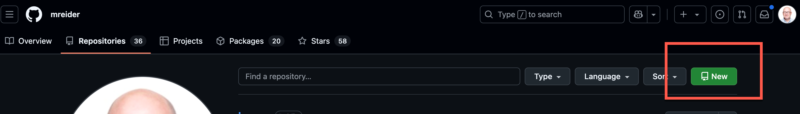
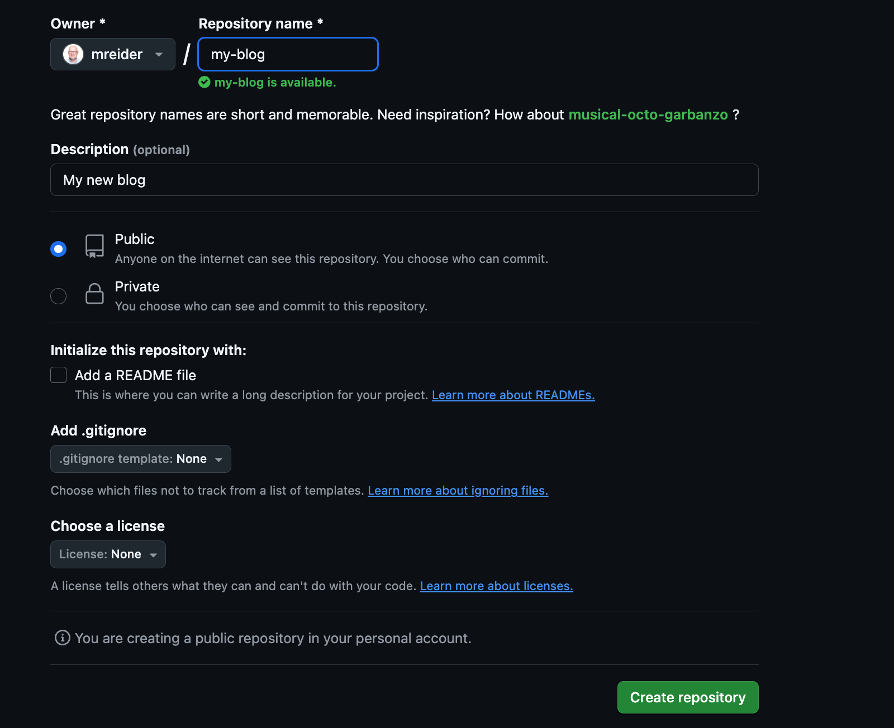
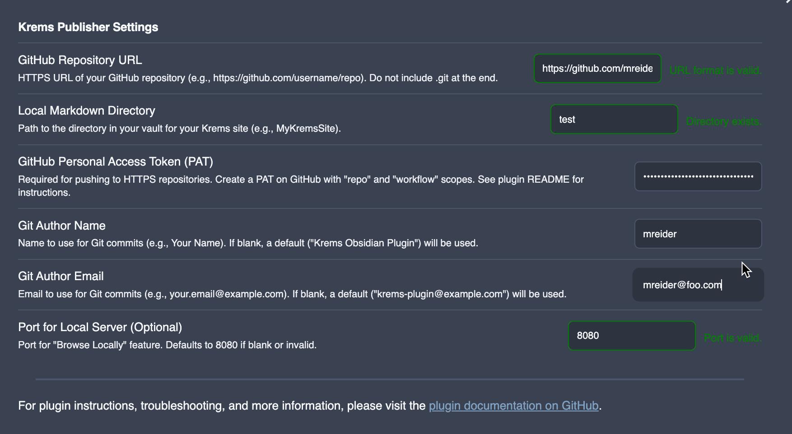
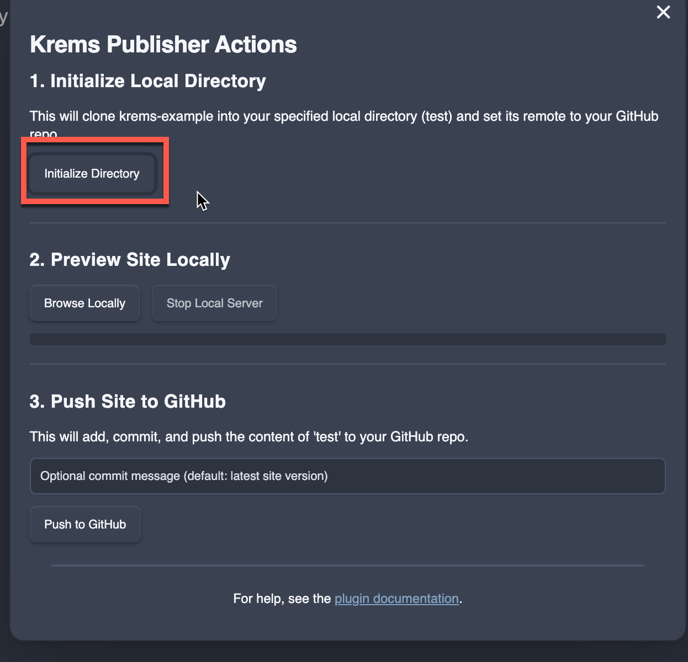

# Krems Obsidian Plugin

This plugin allows you to publish a markdown website to Github Pages using [Krems](https://github.com/mreider/krems) from Obsidian.

## How It Works

### Sign up for a Github account

1. Go to [github.com](https://github.com)
2. Click **Sign up** in the top right corner

### Download and Configure Git

#### macOS (Homebrew)
```bash
brew install git
```

#### Windows
Download from [git-scm.com](https://git-scm.com/download/win) or use package manager:
```powershell
# Using Chocolatey
choco install git

# Using winget
winget install Git.Git
```

### Initial Configuration

Set your identity (required):
```bash
git config --global user.name "Your Name"
git config --global user.email "your.email@example.com"
```

### SSH Setup

Generate SSH key:
```bash
ssh-keygen -t ed25519 -C "your.email@example.com"
```

Add to SSH agent:
```bash
# macOS
ssh-add ~/.ssh/id_ed25519

# Windows (Git Bash)
eval "$(ssh-agent -s)"
ssh-add ~/.ssh/id_ed25519
```

Copy public key to clipboard:
```bash
# macOS
pbcopy < ~/.ssh/id_ed25519.pub

# Windows
clip < ~/.ssh/id_ed25519.pub
```

### Add the public key to GitHub

- Go to [github.com](https://github.com)
- Click your profile picture (top right)
- Select **Settings**
- Click **SSH and GPG keys** in the left sidebar
- Click **New SSH key**
- Give it a descriptive title (e.g., "MacBook Pro", "Work Laptop")
- Paste your public key in the **Key** field
- Click **Add SSH key**
- Enter your GitHub password if prompted

### Create a new Github repository



### Name it after your blog



### Create a GitHub Classic Personal Access Token

- Go to [github.com](https://github.com)
- Click your profile picture (top right)
- Select **Settings**
- Click **Developer settings** (bottom of left sidebar)
- Click **Personal access tokens**
- Select **Tokens (classic)**
- Click **Generate new token**
- Select **Generate new token (classic)**
- Give it a descriptive name (e.g., "Workflow automation", "CI/CD token")
- Choose appropriate duration (30 days, 90 days, 1 year, or custom)
- Required permissions:
- ✅ `repo` (Full control of private repositories)
    - This includes all sub-scopes: repo:status, repo_deployment, public_repo, repo:invite, security_events
- ✅ `workflow` (Update GitHub Action workflows)
- Copy the token immediately - you won't see it again

### Install BRAT

1. Open Obsidian
2. Go to **Settings** > **Community plugins**
3. Disable **Safe mode** if not already done
4. Click **Browse** community plugins
5. Search for "BRAT"
6. Install and enable the **Obsidian BRAT** plugin

### Install Krems Plugin via BRAT

1. **Open BRAT settings**
   - Go to **Settings** > **BRAT**

2. **Add the plugin**
   - Click **Add Beta plugin**
   - Enter the GitHub repository URL:
     ```
     https://github.com/mreider/krems-obsidian-plugin
     ```
   - Click **Add Plugin**

3. **Enable auto-updates** (optional)

### Enable the Plugin

1. Go to **Settings** > **Community plugins**
2. Find **Krems** in the installed plugins list
3. Toggle it **on**

### Create an empty directory in your vault (ex: my-blog)

### Krems setup



1. Enter your blog URL (ex: https://github.com/mreider/my-blog)
2. Enter your empty directory name (ex: my-blog)
3. Enter your personal access token
4. Enter your author name and email
5. Keep the port default unless that port is in use

### Run Krems Plugin

Click **Initialize**. This will copy the small example from https://github.com/mreider/krems-example



### Run the site locally

Click **Browse Locally** to see the site in a browser on your local machine.